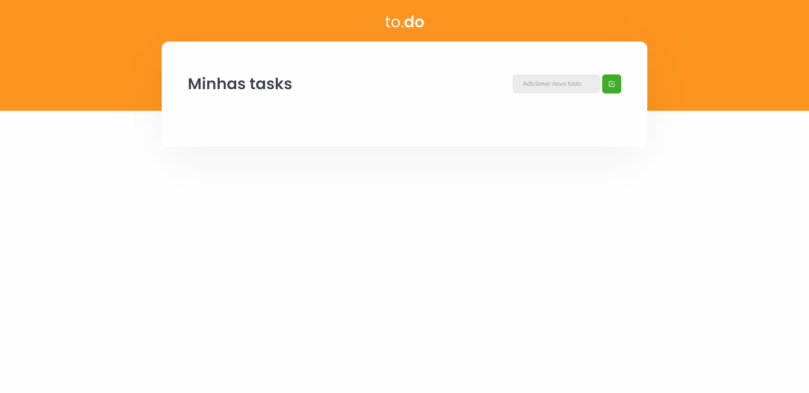

 

<h1 align="center">🚀 Ignite Challenges React</h1>

Challenges of the React Track from the Ignite Bootcamp provided by @Rocketseat.

## 💡 What is it?
This is the first React Challenge from the Rocketseat Ignite.
In this project, i developed a todo list app with some of the basics of React
Fell Free to clone this project

## 🖥 Setup
- Clone the repository
- Run `yarn` to install dependecies
- Run `yarn dev` to run and see the project in port localhost:8080

## 🚧 Built With
- ReactJS
- TypeScript
- Sass

## 📃 Licença
This Project is under MIT License.